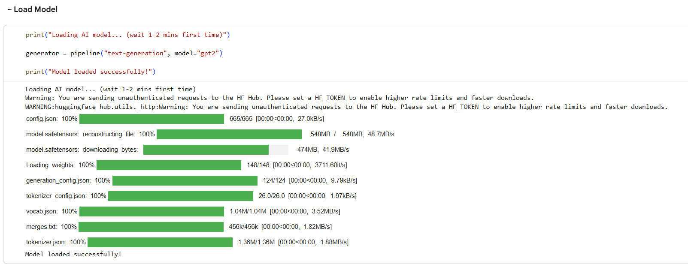

# Story Generation 🤖

An LLM-based project for generating creative stories from user prompts.

## 📌 Project Overview

This project uses a Large Language Model (LLM) to generate stories based on user-provided prompts. The model processes the input prompt and generates text as output.

## 🤖 Model Used

This project uses the **GPT-2 (Generative Pre-trained Transformer 2)** model through the Hugging Face Transformers pipeline for text generation.

## 🛠️ Technologies Used

- Python
- Hugging Face Transformers
- GPT-2
- Natural Language Processing (NLP)

## 🔄 Project Workflow

User Prompt → GPT-2 Model → Text Generation → Generated Story

## ✨ Key Features

- Generates stories from user prompts
- Uses a pre-trained GPT-2 language model
- Implements text generation using Hugging Face Transformers

## 👩‍💻 Author

Yashika Lamba
